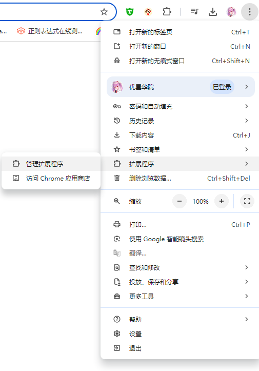
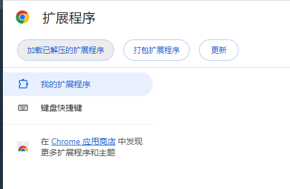
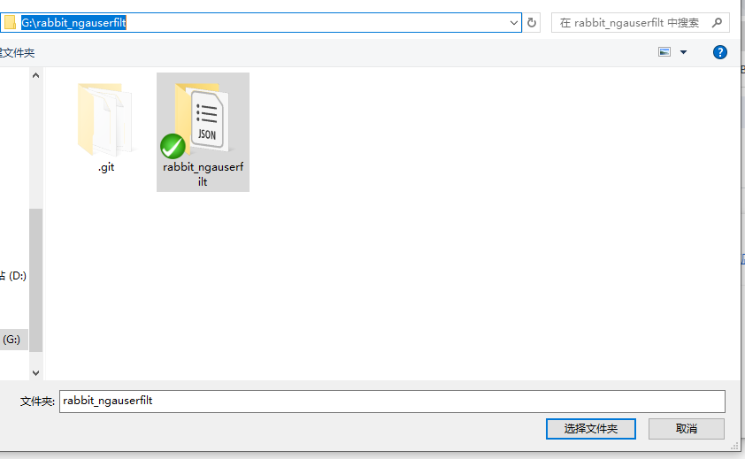
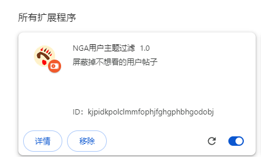
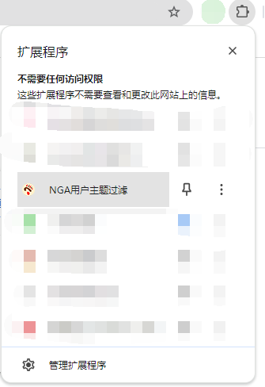
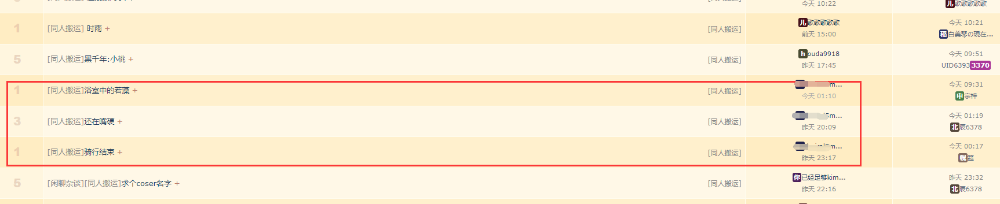
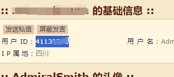
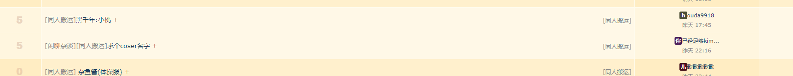

     

# NGA用户主题过滤

      

        此为chrome插件，可在NGA中屏蔽指定用户的主题帖
        NGA本身有屏蔽用户帖子功能，但是只能屏蔽帖子内的，无法屏蔽主题帖
        本插件可以让你根本点不到屏蔽人的帖子

## 下载
[下载页面](https://github.com/MikuNyanya/rabbit_ngauserfilt/releases/tag/v1.0)

## 使用演示     
**1.插件安装**

        下载完后解压，可以得到一个文件夹，在chrome中安装它        
        在chrome浏览器的菜单中 `扩展程序` —> `管理扩展程序`       
 

        然后点击 `加载已解压的扩展程序` 使用文件夹的形式安装插件      
 
 

        安装完成后，应当可以在插件列表中看到本插件了
        chrome的插件栏中也能找到对应图标
 
 

---
**2.插件使用**      
        
        首先我们找个倒霉蛋，虽然他没有做错任何事       
 

        然后点进他的个人信息页，查看他的用户id        
 

        从chrome的工具栏中点开插件的窗口，把用户id添加进屏蔽列表        
 

        然后刷新页面，就可以看到该用户的帖子直接被隐藏掉了       
 
        
___
    在本项目开发过程中，没有任何兔子受到伤害
__联系兔子：q群(857489126)__